   
<h1 align="center">Übungszettel – Datenpersistenz </h1>
<h1 align="center">Name: Michael Bogensberger</h1>
<h1 align="center">Datum: 02.02.2022</h1>
        

# Entwicklungsumgebung einrichten
Zunächst müssen wir die Entwicklungsumgebung einrichten. Dafür installieren wir uns zunächst XAMPP. Der Name "XAMPP" ist eine Abkürzung für Apache, MySQL, Perl und PHP. Das "X" am Anfang bezieht sich darauf, dass das Programm auf verschiedenen Betriebssystemen wie Windows, Linux oder Max OS X läuft. Gegebenen falls muss man in XAMPP Ports ändern. Falls man zum Beispiel die MySql Workbench installiert hat, kann es sein das der Port 3306 bereits belegt ist. Hierfür empfiehlt sich auf den Port 3307 zu wechseln. Danach kann man im Browser die URL: localhost aufrufen. Von dort an kann man in phpMyAdmin einsteigen.
# Projekt anlegen
Als nächsten legen wir in IntelliJ ein neues Maven Projekt an. Dafür wählen wir Maven aus und verwenden dieses Mal keinen Archetype.
## MySql Connector Dependency hinzufügen
Nun fügen wir die MySql Connector Dependency hinzu. Diese wird benötigt, um mit der Datenbank kommunizieren zu können. Dazu fügen wir folgendes in der pom.xml hinzu.

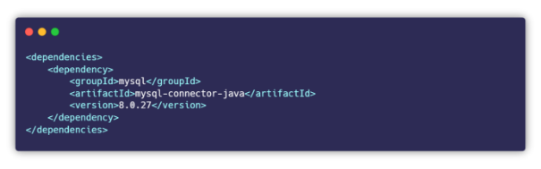
# Verbindung zu Datenbank herstellen

In folgendem Codeabschnitt wird dargestellt wie man mithilfe der MySql Connector Dependency eine Verbindung zur Datenbank herstellen kann.

# Einfaches CRUD Beispiel mit JDBC
Nun war es die Aufgabe mithilfe der Videos ein einfaches CRUD Programm mithilfe von JDBC zu gestalten. Dabei geht es im Wesentlichen um das Auslesen von Studenten, dem einfügen von Studenten sowie dem löschen von Studenten. Der Code zum Beispiel ist hier zu finden: [jdbcCrudExample](https://github.com/MichaelBogensberger/DatenpersistenzFSE).

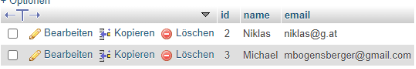
Hier ist der Aufbau der Student Tabelle zu sehen:

## CRUD Beispiel erweitern

Als nächstes sollten wir das vorherige Beispiel um eine weitere Tabelle ergänzen und dieses in Java implementieren. Dazu habe ich der Datenbank eine Kurs-Tabelle hinzugefügt. Jeder Student hat mehrere Kurse. Jeder Kurs hat zudem mehrere Studenten. Der Code ist im Gleichen GitHub Repository zu finden wie in der vorherigen Aufgabe.

# JDBC-Zugriff mit dem DAO Entwurfsmuster
Die nächste Aufgabe war es, sich mithilfe der Videos sich mit dem DAO Entwurfsmuster vertraut zu machen. Der Code zur folgenden Aufgabe ist hier zu finden: [GitHub Repo](https://github.com/MichaelBogensberger/DatenpersistenzFSE)
## DAO – Data Access Object
DAO ist ein Entwurfsmuster das einem ermöglicht den Zugriff auf Daten so zu kapseln, das jene Datenquelle relativ einfach getauscht werden kann. Dadurch wird die Programmlogik von technischen Details der Datenspeicherung befreit. Man will also nicht den bestehenden Code angreifen müssen, um Funktionalität hinzufügen zu können. DAO wird also zwischen der Datenbank und dem Code geschalten. Dadurch wird die Kopplung auf ein Minimum heruntergefahren. Wenn sich der JDBC Treiber zum Beispiel ändert, ist der grundsätzliche Code unabhängig. Das entkoppeln ist das zentrale des DAO Design Patterns.
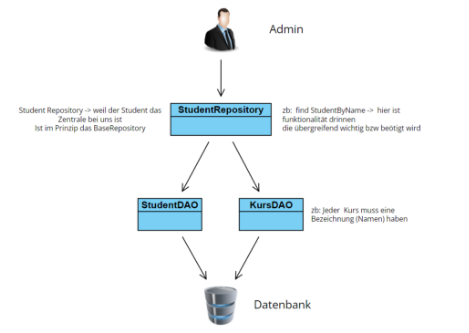

Wie wir sehen können bringt uns also DAO den großen Vorteil der geringen Kopplung. Dies ist auch nochmal in folgender Grafik veranschaulicht.

## Singleton Pattern
Um die MySql Connection nur einmal aufbauen zu können verwenden wir das Singleton Pattern. Beim Singleton Pattern handelt es sich in Java um genau eine Klasse. Diese darf nur ein einziges Mal istanziert werden. Während der Programmlaufzeit existiert nur ein einziges Objekt. Das Singleton Pattern wurde zudem schon einmal von mit beim Übungszettel Mikroarchitektur beschrieben.

Dabei erstellen wir die MySqlDatabaseConnection Klasse. Diese liefert die Connection zurück. Hier ist es eben wichtig das nur eine Connection existiert. Dabei setzen wir den Konstruktor au private. Somit kann dieser nicht aufgerufen werden. Danach checken wir ob die Connection bereits existiert. Existiert diese nicht, wird eine neue Connection erstellt und zurückgegeben.

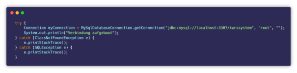

## Cli Klasse
  
Für die Ausgabe erstellen wir uns eine eigene Cli Klasse. Dort erstellen wir uns im Konstruktor einen Scanner und ein Switch Case mit dem wir durch die verschiedenen Auswahlmöglichkeiten iterieren.

## Domain Package
Nun erstellen wir uns ein Domain Package und darin die Entitäten als Klassen. Zunächst legen wir eine Course Klasse und eine Course Type Klasse an. Die Course Type Klasse ist ein Enum und enthält die verschiedenen Course Typen. Danach erstellen wir eine BaseEntity Klasse. Jene ist dafür da, die ID nicht immer händisch eintragen zu müssen. Sie kümmert sich also um die Logik der IDs. In der Course Klasse haben wir die jeweiligen Getter und Setter und zwei Konstruktoren. Einen bei dem die ID mit übergeben wird und gesetzt wird, und einen wo keine ID mit übergeben wird. In diesem Fall wird die ID auf NULL gesetzt.

` `Nun schaut unser Package folgendermaßen aus:

## Base Repository
Nun erstellen wir uns ein BaseRepository. Dieses kann ich nun für jede Art von Entität verwenden. Dabei werden Generics verwendet. Dabei gibt es einmal T für den Typen und I für die ID. Folgende Methoden müssen implementiert werden.

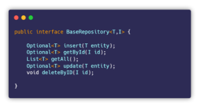

## MyCourseRepository Repository
Nun erstellen wir ein CourseRepository. Dieses erbt das BaseRepository. Dabei wird dieses mit Course und Long getypt. Course als Entitytyp und Long als Schlüsseltyp. Der Vorteil ist, dass ich das BaseRepository immer verwenden kann und jetzt zb im CourseRepository zusätzlich Funktionen spezifizieren.

## MySqlCourseRepository Klasse
Als nächstes erstellen wir eine MySqlCourseRepository Klasse. Hier wird jetzt klar gemacht welche Technologie (MySql) verwendet wird. Diese Klasse implementiert nun die MyCourseRepository Klasse. Nun müssen wir also alle Methoden der beiden obigen Repositories implementieren. 

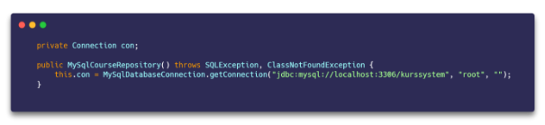  
Dazu erstellen wir uns zunächst eine Connection. Da wir ja die MySqlDatabaseConnection Klasse haben können wir diese dafür verwenden.

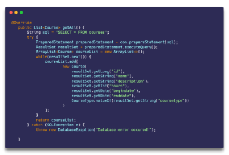  
Nun fangen wir an die getAll() Methode mit Funktionalität zu befüllen. In der while Schleife befüllen wir nun die ArrayList mit den jeweiligen Werten. Hier sollte man genau auf die Labels achten! Nun haben wir ja eine Enumeration für den Kurstypen (CourseType). Wir bekommen jedoch einen String aus der DB zurück. Deshalb müssen wir hier den String noch in einen CourseType konvertieren. Diese sieht nun wie folgt aus:

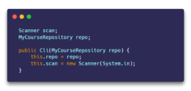
Nun gehen wir in die Cli Klasse und fügen im Konstruktor ein MyCourseRepository hinzu. Danach fügen wir im Switch Case im zweiten Case die Methode showAllCourses hinzu. Diese müssen wir natürlich noch implementieren.

1. ## showAllCourses Methode
  
Nun können wir die showAllCourses Methode implementieren. Dazu erstellen wir zunächst eine List vom Typ Course. Danach befüllen wir die Liste über das Repository mit getAll(). Nun checken wir ob die liste leer ist. Ist sie es nicht, gehen wir durch die jeweiligen Kurse in der Liste durch und geben diese aus. Dazu haben wir ja auch die toString Methode implementiert. Jene wird nun im „sout“ verwendet. Danach umgeben wir das ganze noch mit einem try catch und sagen was passiert wenn Fehler auftreten. 

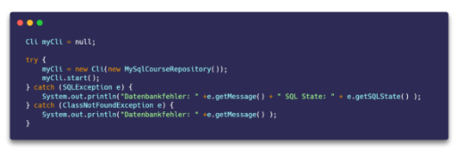  
Schließlich können wir in die App Klasse bzw. Main Methode wechseln. Hier erstellen wir ein Cli Objekt. Das wichtige ist nun, dass wir dem Cli Objekt ein MySqlCourseRepository mitgeben.

Das Zusammenspiel mit den Repositories wird in folgender Grafik nochmal genauer dargestellt. Hier ist gut zu sehen welche Klasse welche Repositories verwendet. Zurzeit verwendet die Cli nur das MyCourseRepository. Das kann sich jedoch mit zusätzlicher Funktionalität ändern. 

## Assert Klasse
Nun erstellen wir uns ein util Package. Darin erstellen wir uns eine Assert Klasse. Diese dient dazu zu checken ob ein Objekt null ist oder nicht. 

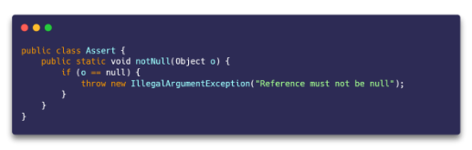

## Kurs durch ID bekommen (getById Methode)
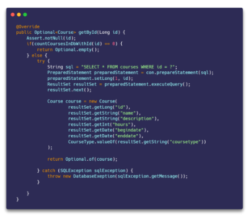  
Nun programmieren wir die Funktionalität der getById Methode.

## Neuen Eintrag hinzufügen (insert Methode)  
  
Nun programmieren wir die insert Methode.  Wie wir sehen ähnelt diese Methode ebenfalls den anderen. Wichtig ist hier jedoch, dass wir oben beim preparedStatement noch sagen, dass wir die generierten Keys zurückbekommen wollen. Unten erstellen wir uns dann ein ResultSet mit den generierten Schlüsseln. Wenn nun ein Key im ResultSet existiert, rufen wir die getById Methode auf und übergeben als ID die erste Stelle vom ResultSet, da wir ja nur einen Datensatz einfügen können wir das gleich schon so definieren.
## Cli anpassen (insert Methode)
Nun passen wir noch die Cli Klasse an. Wichtig ist hier, dass wir alle Werte einlesen und alle Fehlerprüfungen durchführen. Danach legen wir einen neuen Kurs (course Objekt) mit den eingegebenen Daten an und übergeben diesen der insert Methode. Wenn das Optional infolgedessen nicht leer ist, geben wir den Kurs aus.

## Kurs updaten (update Methode)
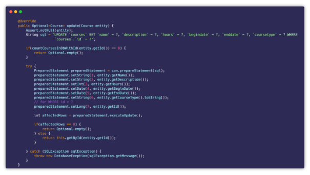  
Als nächstes programmieren wir die update Methode. Hier übergeben wir einen Kurs und updaten die jeweiligen Felder basierend auf der ID des übergebenen Kurses. Diese sieht dann wie folgt aus:

## Cli anpassen (update Methode)
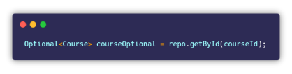  
Natürlich müssen wir nun wieder die Cli Klasse anpassen. Wichtig ist hier, dass wir die ID von jenem Kurs bekommen der zu ändern ist. Danach suchen wir uns den Kurs mit der übergebenen ID heraus.

Danach geben wir den gefunden Kurs aus und lesen die restlichen Werte ein. Wir sagen aber, dass wenn man für zb die Beschreibung nicht eingibt (nur Enter drückt) nichts geändert werden soll.

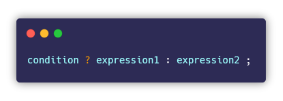
  
Nun rufen wir die update Methode auf. Hier können wir auf jeden Fall mal die ID übergeben. Nun sagen wir, wenn zb der übergebene Name leer ist, dann füllen wir hier einfach den Namen vom bereits gefundenen Kurs ein. Andernfalls übergeben wir den eingebenden Namen.

Hierbei handelt es sich um eine kurzschreibweise einer IF-Else Anweisung. Dies funktioniert folgendermaßen:

  
Abschließen rufen wir noch ifPresentOrElse() auf dem geupdateten Kurs auf. Hier können wir sagen, wenn es vorhanden ist, geben wir den Kurs (c) aus. Andernfalls geben wir aus, dass der Kurs nicht geändert werden konnte.

1. ## Kurs löschen (deleteByID Methode)
  
Nun programmieren wir die deleteByID Methode. Diese ist vergleichsweise einfach gestrickt. Natürlich müssen wir dann auch wieder die Cli Klasse anpassen. Dazu wird im Repository nun nur folgender Code benötigt:

## Kurs durch Namen oder Beschreibung finden
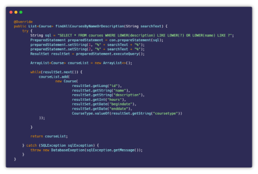  
Nun programmieren wir die findAllCoursesByNameOrDescription Methode. Dazu haben wir folgendes SQL Statement. Die „LOWER“ Anweisung setzt die Werte lediglich auf Lower Case. Nun fügen wir wieder die Werte in die Fragezeichen ein. Hier haben wir noch jeweils Prozentzeichen. Diese dienen dazu, alle Werte zu finden die irgendwo jenen übergebenen String beinhalten. Danach gehen wir wieder alle zurückgebenden Zeilen durch und fügen jeweils die Kurse in eine ArrayList hinzu. Danach geben wir diese einfach zurück.

## Alle laufende Kurse finden
  
Als nächstes implementieren wir die findAllRunningCourses Methode. Diese ähnelt wieder stark der obigen Methode. Das wichtigste was sich hier ändert ist das SQL Statement. Nun schaut das ganze folgendermaßen aus:

## UML Diagramme
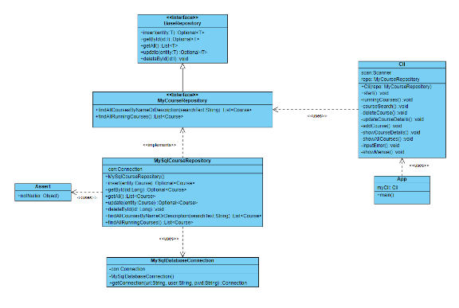  
 Der nun erstelle Code lässt sich in folgendem UML Diagramm darstellen:

Für das Domain Package ergibt sich folgendes UML Diagramm:   

1. # JDBC und DAO – Studenten
Erweitere die fertig nachprogrammierte Applikation mit einem DAO für CRUD für eine neue Domänenklasse „Student“:

- Studenten haben einen eine Student-ID, einen VN, einen NN, ein Geburtsdatum
- Domänenklasse implementieren (Setter absichern, neue Exceptions definieren, Business-Regeln selbst wählen - z.B. dass Name nicht leer sein darf)
- Eigenes Interface MyStudentRepository von BaseRepository ableiten. MyStudentRepository muss mindestens 3 studentenspezifische Methoden enthalten (z.B. Studentensuche nach Namen, Suche nach ID, Suche nach bestimmtem Geburtsjahr, Suche mit Geburtsdatum zwischen x und y etc.).
- Implementierung von MyStudentRepository durch eine neue Klasse MySqlStudentRepository analog zum MySqlCourseRepository.
- Erweiterung des CLI für die Verarbeitung von Studenten und für spezifische Studenten-Funktionen (z.B. Student nach dem Namen suchen)

Der Sourcecode zur Übung ist unter folgendem Link im GitHub zu finden: [JDBC-Student-Übung](https://github.com/MichaelBogensberger/DatenpersistenzFSE/tree/main/myCourseSystemWithStudent)
# JDBC und DAO – Buchungen
Gib einen textuellen Vorschlag hab, wie man die bisher programmierte Applikation für die Buchung von Kursen durch Studenten erweitern könnte. Beschreibe, wie eine neue Buchungs-Domänenklasse ausschauen sollte, wie man ein DAO für Buchungen dazu entwickeln sollte, wie man die CLI anpassen müsste und welche Anwendungsfälle der Benutzer brauchen könnte (wie etwa „Buchung erstellen“). Verwende zur Illustration insb. auch UML-Diagramme.

Zunächst müsste man eine N zu M Verbindung zwischen dem Studenten und dem Kurs hinzufügen. Die nun erstelle Zwischentabelle wird nun Buchungen genannt. So kann ein Student mehrere Buchungen haben und ein Kurs kann zu mehreren Buchungen gehören. In der Buchung könnte dann zb das Buchungsdatum und der Buchungszeitraum stehen.

Im „dataaccess“ Package würde man nun eine MySqlBuchungRepository Klasse und ein MyBuchungRepository Interface brauchen. Im „domain“ Package würde man eine Klasse Buchung brauchen. In der Cli Klasse müsste man einfach die Anwendungsfälle hinzufügen. Diese wären zb: 

- BaseRepo:
  - Buchung erstellen
  - Buchung updaten
  - Buchung löschen
  - Alle Buchungen ausgeben
  - Spezifische Buchung ausgeben
- MyBuchungRepository:
  - Buchungen zwischen Datum X und Datum Y finden
  - Abgelaufene Buchungen finden
  - Laufende Buchungen finden

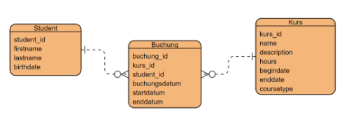  
In folgender Abbildung wäre eine Mögliche Version der Implementierung als ER-Modell zu sehen:

Ein dazugehöriges UML Diagramm könnte dann folgendermaßen aussehen:

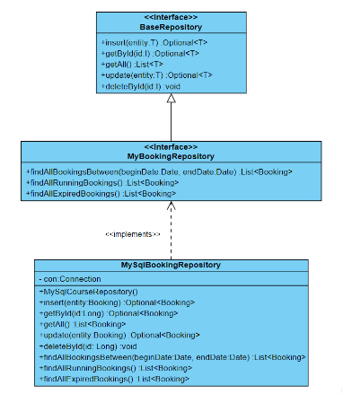
## Alle laufende Kurse finden

# ResultSet.next() Hinweis
Wenn ich mehrere Rows (Zeilen) zurück bekomme ist es klar das ich mit .next() durch die jeweiligen Zeilen springen muss. Wenn ich jedoch nur eine Zeile zurückbekomme muss ich auch einmal .next() ausrufen. Deshalb ja nicht den Befehl .next() vergessen!

